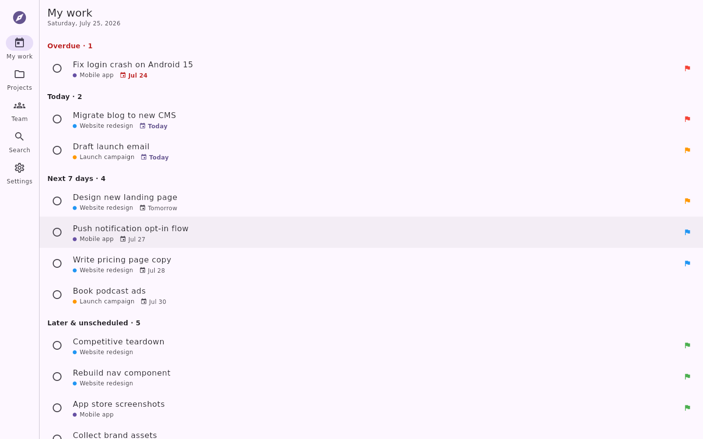
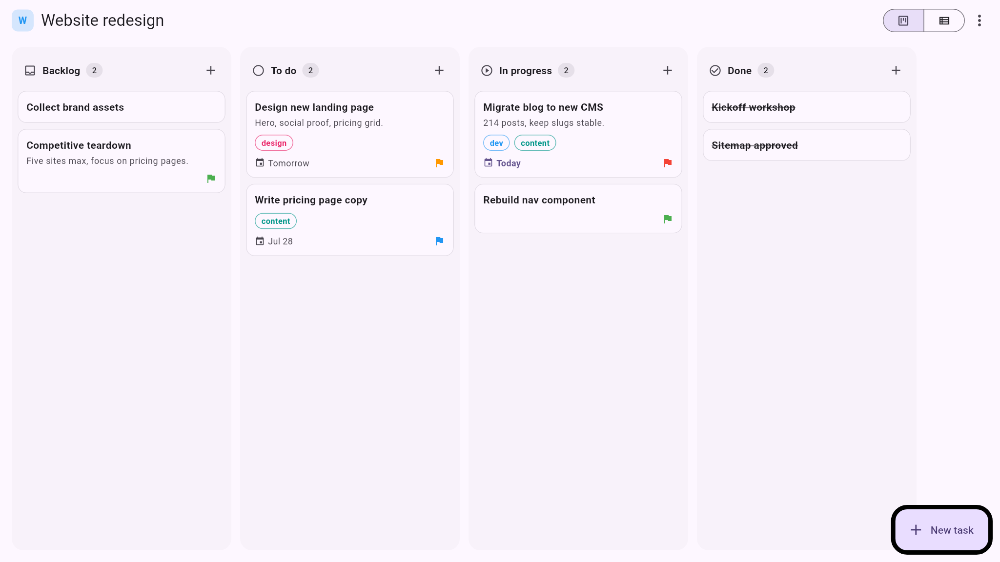
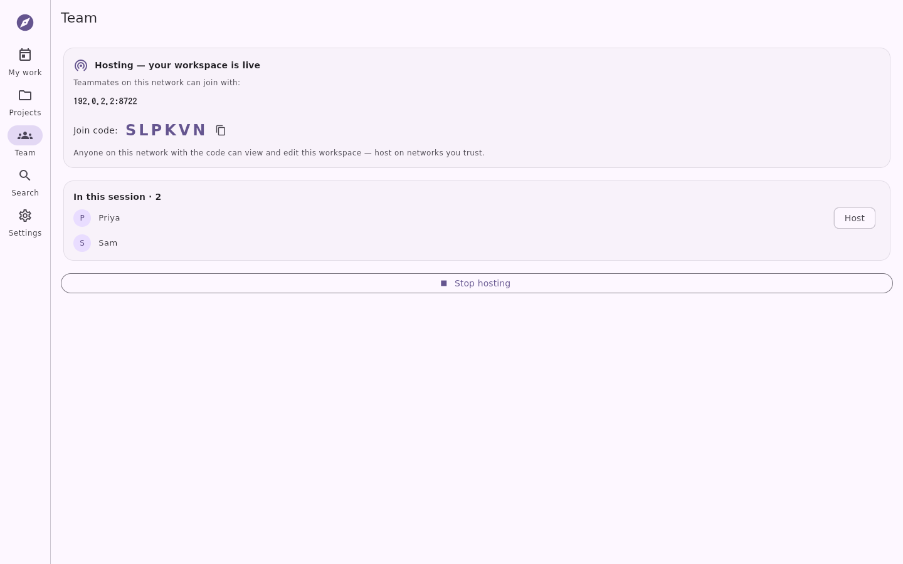
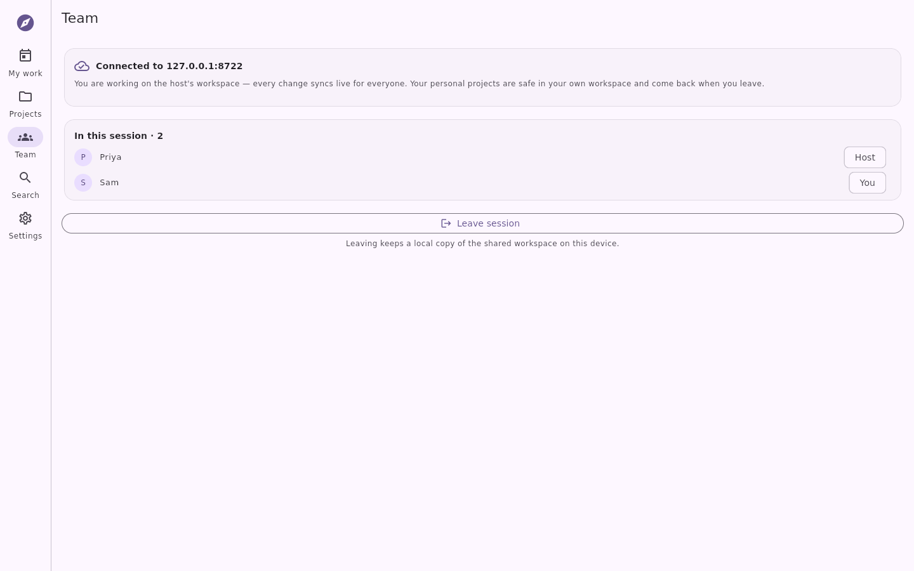
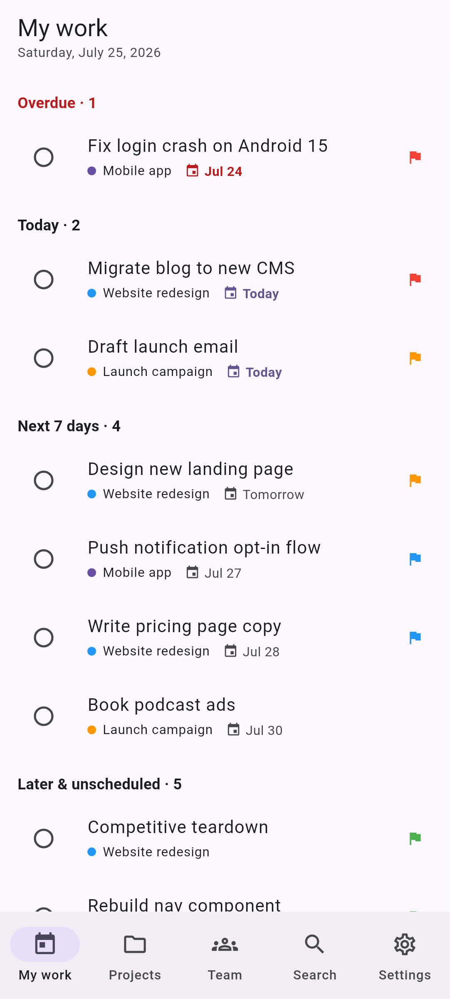
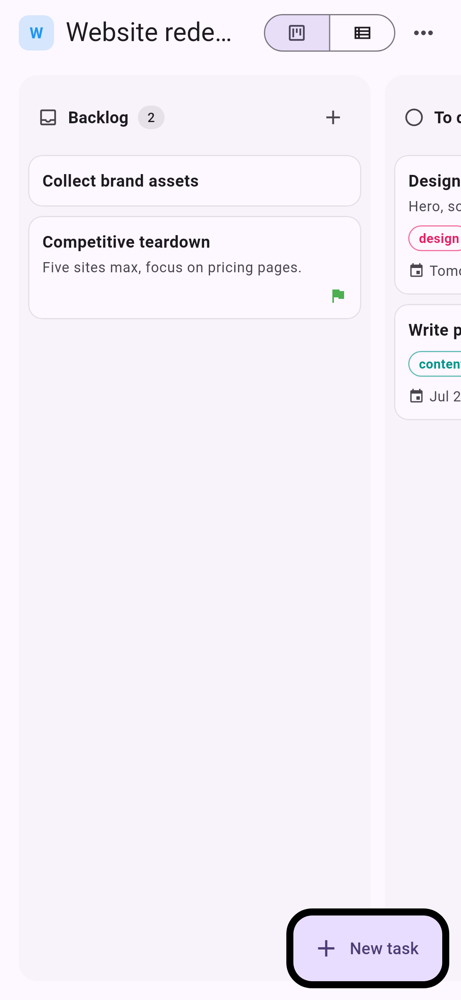
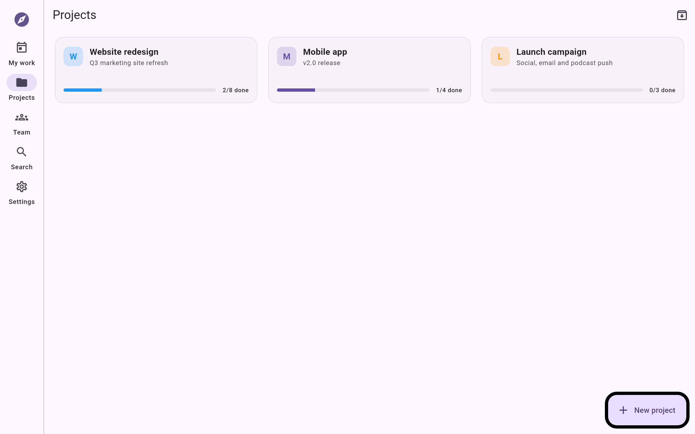

# Waypoint

**Free, local-first project management for small teams and personal projects.**
One codebase, five platforms: Android, iOS, macOS, Windows and Linux.

Tools like Monday.com and Asana are built for big corporations — and priced and
designed accordingly. Waypoint is a full project management app scaled for the
rest of us: every feature is free, your data lives on your device, and nothing
is locked behind a paywall.

## The model (inspired by Obsidian)

| | |
|---|---|
| **The app** | Free, forever. Every feature. No seat limits, no "premium views". |
| **Your data** | Local SQLite database on your device. Export/import as plain JSON anytime. |
| **Team collaboration** | Free, over your own LAN: one person hosts, teammates join with a code. No account, no cloud. |
| **Sync & storage** (planned) | Optional paid service: end-to-end-encrypted sync across devices and hosted file storage — for people who want the convenience of not running anything themselves. |

You never *need* the paid tier. Backups are plain JSON, the sync interface is
small and documented (`lib/sync/sync_service.dart`), and self-hosting your own
sync target is an explicit design goal.

## Screenshots

| Linux (native capture) | Windows form factor — board |
|---|---|
|  |  |

| Team session — hosting (native) | Team session — teammate joined (native) |
|---|---|
|  |  |

| Android — My work | iOS — board | macOS — projects |
|---|---|---|
|  |  |  |

<sub>How each image was produced (and how to regenerate them) is documented in
[`docs/screenshots/README.md`](docs/screenshots/README.md).</sub>

## Features (v0.1)

- **Projects** — color-coded, with descriptions, live progress bars, archiving
- **Kanban board** — drag & drop between Backlog / To do / In progress / Done,
  reorder within columns, mouse and touch friendly
- **List view** — the same tasks grouped by status, one tap to complete
- **Tasks** — notes, priorities, due dates, subtask checklists, labels
- **My work** — cross-project dashboard: overdue, today, next 7 days, later
- **Search** — instant, across titles and notes in every project
- **Team sessions** — the project manager hosts the workspace from their own
  device; teammates on the same network join with an address + code and edit
  live together. Presence shows who's in the session. A teammate's personal
  workspace stays untouched (sessions use a separate local database), and
  leaving keeps a local copy of the shared workspace.
- **Backup** — one-tap JSON export/import of the entire workspace
- **Dark mode** — light / dark / follow system, remembered across launches
- Fully **offline** — no account, no network calls unless you host/join a
  session on your own LAN; works on a plane

## Tech

| Layer | Choice | Why |
|---|---|---|
| UI | [Flutter](https://flutter.dev) | Single codebase for all five platforms |
| State | [Riverpod](https://riverpod.dev) | Stream-based providers over the reactive DB |
| Storage | [Drift](https://drift.simonbinder.eu) (SQLite) | Typed, reactive queries; works everywhere incl. mobile |
| Collaboration | Plain WebSockets (`dart:io`), host-authoritative row-level ops | Zero dependencies, zero infrastructure; every mutation is an idempotent upsert/delete keyed by UUID, so replicas converge without merge logic |
| Sync seam | `SyncService` interface | App only talks to the interface; local-only impl ships today, cloud impl plugs in later |

How a team session works: every edit in the UI goes through `Workspace`
(`lib/data/workspace.dart`), which turns it into row-level ops, applies them
to the local database and hands them to the live session. The host
(`lib/sync/session.dart`) applies client ops in arrival order and rebroadcasts
them; new joiners get a full snapshot (same format as backups) before the op
stream. Trust model v1: anyone on the LAN with the join code can edit — host
on networks you trust. TLS + per-member auth ride the same roadmap as hosted
sync.

```
lib/
├── main.dart, app.dart      # entry, theming, adaptive shell (rail ⟷ bottom bar)
├── providers.dart           # Riverpod wiring
├── data/
│   ├── database.dart        # drift schema + all queries (tables: projects,
│   │                        #   tasks, subtasks, labels, task_labels)
│   ├── backup.dart          # JSON export/import of the whole workspace
│   └── enums.dart           # statuses, priorities, palette
├── sync/sync_service.dart   # the free/paid seam (local-only impl today)
├── features/
│   ├── home/                # "My work" dashboard
│   ├── projects/            # overview grid, project page, editors
│   ├── board/               # kanban with drag & drop
│   ├── tasks/               # task editor sheet (subtasks, labels, dates)
│   ├── search/
│   └── settings/            # theme, sync status, backup
└── widgets/                 # shared chips, avatars, empty states
```

## Getting started

Requires [Flutter](https://docs.flutter.dev/get-started/install) 3.44+.

```sh
flutter pub get
flutter run                  # picks a connected device/desktop
```

Run on a specific platform: `flutter run -d macos|windows|linux|<device-id>`.

Tests and analysis:

```sh
flutter analyze
flutter test
```

After changing the database schema, regenerate drift code:

```sh
dart run build_runner build --delete-conflicting-outputs
```

## Roadmap

- [ ] Custom board columns per project (schema is ready for the migration)
- [ ] File-based backup pickers + automatic scheduled backups
- [ ] Recurring tasks and reminders/notifications
- [ ] Calendar and timeline views
- [ ] Session hardening: TLS, per-member auth, mDNS discovery, host handoff
- [ ] Comments and assignees on top of team sessions
- [ ] **Waypoint Sync** — optional paid, E2E-encrypted, self-hostable protocol
  (same op stream as LAN sessions, relayed through a server you don't have to run)

## License

TBD — the intent is a permissive license for the app, with the hosted sync
service as the commercial component.
