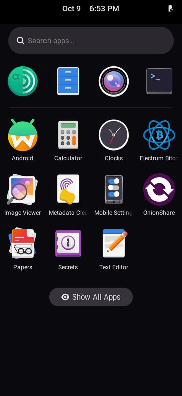
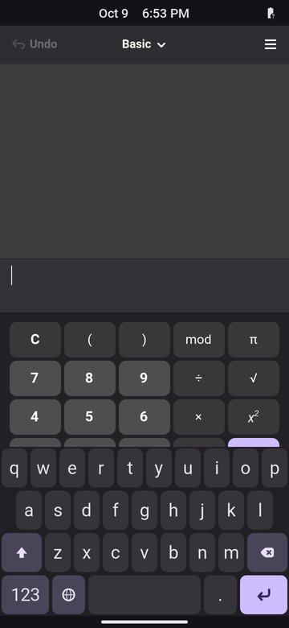

# Nested-Phosh experiment (9 Oct 2026)

Can Antumbra's real Phosh session run inside an ordinary X server, without
systemd, logind or a display of its own? That is what a Termux preview on
an Android phone needs: Termux:X11 is an X server, and proot gives no
systemd. This experiment answered the question on a build host, not on a
phone: **yes, with a launcher that does without gnome-session**.

What was and was not tested:

- **Tested:** the arm64 root filesystem of the 6 Oct 2026 qemu-virt image
  built with Android apps (`ANTUMBRA_ANDROID=1`), unchanged except for a
  small overlay, running nested in Xvfb.
- **Not tested:** Termux, proot, Termux:X11 or a phone. The binaries ran
  under qemu-user (`qemu-aarch64-static` through binfmt_misc) on an x86-64
  cloud host with 4 vCPUs, in a plain root `chroot` (proot was not
  installed). Times and memory include the emulator's overhead.




Both screenshots come from run 5 (720x1560 at scale 2, shown here at half
size). The battery icon is empty because nothing provides one; the clock is
the host's.

## Files

| File | What it is |
|---|---|
| `antumbra-preview` | the launcher without gnome-session (run 5), rebuilt from the run's record: the file itself lived only in the experiment's overlay, which was deleted |
| `phoc-x11.ini` | the `/etc/phosh/phoc.ini` of runs 3 to 7: Antumbra's phoc settings plus the nested `X11-1` output |
| `gpt.py` | prints the outer GPT of `vm-disk.img` and the nested GPT in its `userdata` partition, read-only |
| `setup.sh` | binds `/proc`, `/sys`, `/dev`, `/dev/pts`, `/dev/shm` and `/tmp/.X11-unix` into the root filesystem and creates `/run/user/1000` (root) |
| `run-as-user.sh` | runs a command in the root filesystem as `amnesia` (uid 1000) with a clean environment for phoc's X11 backend; output to `logs/NAME.log` |
| `xin.py` | XTEST pointer clicks, drags and key presses on an X display (ctypes, libX11 and libXtst) |
| `killchroot.sh` | stops every process whose root is the experiment's root filesystem (root) |

The shell scripts take the experiment's work directory from
`ANTUMBRA_EXP`; it holds `root/` (the mounted overlay) and `logs/`. Keep it
outside the repository.

## What was run

Everything below ran as root on the build host, read-only on the image:
`vm-disk.img`'s SHA-256 was the same before and after.

1. Find the live partition. `gpt.py build/out/qemu-virt/vm-disk.img`
   showed the outer GPT (4096-byte sectors) with `userdata` at byte
   1048576, and inside it `ANTUMBRA_LIVE` at absolute byte 2097152 (size
   1442840576) and `ANTUMBRA_DATA` at 1444937728.
2. Mount it, the squashfs inside it, and an overlay over that:

   ```sh
   cd "$ANTUMBRA_EXP"; mkdir -p mnt/live mnt/sq ov/upper ov/work root logs
   losetup -r -f --show -o 2097152 --sizelimit 1442840576 build/out/qemu-virt/vm-disk.img   # /dev/loop0
   mount -o ro,noload /dev/loop0 mnt/live            # ext4 holding live/filesystem.squashfs
   mount -t squashfs -o ro,loop mnt/live/live/filesystem.squashfs mnt/sq
   mount -t overlay overlay -o lowerdir=mnt/sq,upperdir=ov/upper,workdir=ov/work root
   ```

3. Let the host run arm64 binaries (binfmt_misc was not mounted):

   ```sh
   mount -t binfmt_misc binfmt_misc /proc/sys/fs/binfmt_misc
   cat /usr/lib/binfmt.d/qemu-aarch64.conf > /proc/sys/fs/binfmt_misc/register   # flags POF
   chroot root /bin/uname -m                                                     # aarch64
   ```

4. `setup.sh` for the bind mounts and the runtime directory.
5. An X server and its tools on the host: `Xvfb :5 -screen 0 720x1560x24
   -nolisten tcp -ac`; screenshots with ImageMagick (`DISPLAY=:5 import
   -window root out.png`; the host has no `xwd`); input with `xin.py :5`.
6. The runs, each through `run-as-user.sh`, which sets `HOME=/home/amnesia`,
   `XDG_RUNTIME_DIR=/run/user/1000`, `DISPLAY=:5`, `WLR_BACKENDS=x11` and
   `WLR_RENDERER=pixman`. A session's D-Bus address, where needed, came
   from `/proc/<phosh pid>/environ`.

| Run | What | Result |
|---|---|---|
| 1 | The real path: `dbus-run-session -- /usr/libexec/antumbra-session` | fails at once: `Failed to create stream fd: No such file or directory`. `phosh-session` wraps phoc in `systemd-cat` whenever that exists (image `/usr/bin/phosh-session` lines 49-50, 57), and `systemd-cat` needs journald |
| 2 | The same, with a 4-line `systemd-cat` shim in the overlay's `/usr/local/bin` that skips `-t TAG` and execs the rest | gnome-session 48 logs "Falling back to non-systemd startup procedure" and "Using null backend for session tracking", and starts phosh: "Phosh ready after 36.55s" (cold). The window is 360x720, from Debian's `/usr/share/phosh/phoc.ini`, and phoc tries to start Xwayland. The theme stubs were written |
| lock | `org.gnome.ScreenSaver.Lock` over D-Bus | the output blanks (the X window is unmapped) until `org.gnome.ScreenSaver.SetActive false`; pointer drag, wheel, Return and a click on the arrow do not get past "Slide up to unlock" |
| 3 | Phone-shaped: `phoc-x11.ini` as `/etc/phosh/phoc.ini`, which `phosh-session` prefers | 720x1560 at scale 2 (360x780 logical), "Phosh ready after 25.15s"; the idle lock fires 120 s after the last input. Then `gsettings set org.gnome.desktop.session idle-delay 0` and `gsettings set org.gnome.desktop.screensaver lock-enabled false` in the session |
| 4 | The same as run 3 | gsd-power exits with code 1 and is "respawning too quickly"; gnome-session shows its "Oh no! Something has gone wrong" screen 18 s after Phosh was ready |
| 5 | **No gnome-session:** `antumbra-preview` in the overlay, started as `dbus-run-session -- /usr/local/bin/antumbra-preview` with `GSK_RENDERER=cairo` | "Phosh ready after 25.28s". A tap on Calculator gave a window about 30 s later, with squeekboard up. No failure screen |
| GL | `gnome-text-editor` in run 5's session without `GSK_RENDERER` | GTK 4's default GL renderer through Mesa llvmpipe (EGL on `wl_shm`), drawn in about 31 s |
| 6, 7 | A system bus by hand: `dbus-uuidgen --ensure=/etc/machine-id` (empty in the image), `dbus-daemon --system --fork`, `polkitd --no-debug`, `upowerd` | the "Could not connect" errors go, but gsd-power still exits: `Error calling StartServiceByName for org.freedesktop.login1: The permission of the setuid helper is not correct`. Phosh shows a red 0% battery. `upowerd` without `polkitd` first crashed under qemu-user (SIGTRAP) |

In runs 2, 3, 6 and 7 the same gsd-power error did not bring up the
failure screen within the minutes watched, so the gnome-session route is
race-prone without logind rather than always broken.

7. Clean-up: `killchroot.sh`, stop Xvfb, unmount `tmp/.X11-unix`,
   `dev/shm`, `dev/pts`, `dev`, `sys`, `proc`, the overlay, the squashfs and
   the live partition, `losetup -d /dev/loop0`, `echo -1 >
   /proc/sys/fs/binfmt_misc/qemu-aarch64`, unmount binfmt_misc, remove the
   work directory. The overlay's upper directory peaked at about 1.5 MB.

## The launcher without gnome-session

The reliable route, and the one the preview kit should use:

```sh
# as the user, DISPLAY set to the X server
dbus-run-session -- /usr/local/bin/antumbra-preview
# which sets XDG_SESSION_TYPE=wayland XDG_CURRENT_DESKTOP=Phosh:GNOME
# XDG_SESSION_DESKTOP=phosh GDMSESSION=phosh WLR_BACKENDS=x11 WLR_RENDERER=pixman
# GSK_RENDERER=cairo, writes the two gtk.css theme stubs, then:
exec phoc -v -S -C /etc/phosh/phoc.ini \
    -E "sh -c '/usr/bin/squeekboard & exec /usr/libexec/phosh --unlocked'"
```

`--unlocked` is phosh's own development flag. This route runs about 10
processes (dbus-daemon, phoc, phosh, squeekboard, xdg-desktop-portal and
its gtk, gnome and phosh back ends, gvfsd, dconf-service, feedbackd)
against roughly 25 on the gnome-session route, which matters for Android
12's limit of 32 child processes across all apps.

## What it means for a Termux preview

- **Needed:** an X server with XFixes, XInput2, Present and MIT-SHM (DRI3
  optional), a session bus (`dbus-run-session`), `WLR_BACKENDS=x11` and
  `WLR_RENDERER=pixman`. **Not needed:** systemd, logind, journald, DRM or
  `/dev/input`. Whether Termux:X11 offers all four extensions to proot
  clients is unverified: check with `xdpyinfo` on the phone first.
- **Turn the idle lock off** (the two `gsettings` above, or a preview copy
  of `/etc/dconf/db/local.d/00-antumbra` without lines 13-17), or start
  phosh with `--unlocked`. Otherwise the window blanks to black after 120 s
  and a pointer cannot swipe past the lock screen. Whether Termux:X11
  delivers real XInput2 touch events, which phoc's X11 backend could turn
  into touches, is unverified.
- **Set `GSK_RENDERER=cairo`** for GTK 4 apps; `antumbra-session-env` sets
  it only inside a VM. Without it GTK 4 draws through llvmpipe, which works
  but costs CPU. Hardware GL would not reach phoc's clients anyway: phoc
  runs pixman with no dmabuf, so the preview is drawn by the CPU and its
  smoothness says nothing about the phone's GPU.
- **phoc settings:** `[output:X11-1] mode = <W>x<H>` plus a scale. 720x1560
  at scale 2 gives 360x780 logical; 960x2080 at scale 2 gives the phone's
  480x1040. Fewer pixels matter a lot with pixman.
- **Cost under qemu-user** (4 vCPUs): Phosh ready in 25 to 37 s, a GTK 4
  app's first frame in about 30 s; RSS phoc 89 MiB, phosh 311 MiB,
  squeekboard 120 MiB, emulator overhead included. Native arm64 avoids the
  instruction translation, but proot's ptrace overhead and pixman at high
  resolution cost something; nothing has been measured on a phone.
- **Not private:** there is no Tor-only firewall in a nested session.
  gnome-calculator tried to resolve `exchange-api.gnome.org` during run 5.
- **Getting the root filesystem onto a phone:** it ships only inside the
  release's userdata image (an ext4 live partition holding
  `live/filesystem.squashfs` in a nested GPT). A preview needs that
  squashfs unpacked in Termux, or a separately published arm64 root
  filesystem.
- **What it cannot show:** greetd and the Welcome flow as a real greeter
  (`antumbra-welcome` has a demo mode that may run on its own; untested),
  the firewall, Persistent Storage, Waydroid, the modem, the cameras, real
  output modes and scale, real touch gestures, power management, boot and
  performance on the phone.

**Side finding (the plan's P1, fixed since: both compositors now read
`/etc/phosh/phoc.ini`):** in the image of 6 October the user session's phoc
never read `/etc/antumbra/phoc.ini`. `phosh-session` looks only at
`/etc/phosh/phoc.ini`, then `/usr/share/phosh/phoc.ini` (image
`/usr/bin/phosh-session` lines 4, 40-41); Antumbra's file is read only by
the greeter (`config/rootfs/usr/libexec/antumbra-greeter-session` lines
17-18). Run 2 confirms it: Debian's default gave the 360x720 window and the
Xwayland attempt. On the phone the session would not have got scale 3, 60 Hz
or `xwayland=false` (inferred, not seen on hardware).

## What was missing, and what was logged

Missing in the chroot, with their effect:

- journald: `systemd-cat` in `phosh-session` fails (run 1).
- `systemd --user`: gnome-session falls back to its built-in start-up
  (harmless).
- logind (`org.freedesktop.login1`): gsd-power exits, so the gnome-session
  failure screen; phosh's torch manager, the polkit agent ("No session for
  pid") and gsd-sharing complain.
- the system bus (until started by hand): NetworkManager, ModemManager,
  bluez, geoclue, hostname1, UDisks2, rfkill, wwan, print notifications
  and USBGuard all "Could not connect".
- UPower (gsd-power cannot start; with `upowerd` running, a 0% battery)
  and polkitd (`upowerd` crashed without it; the setuid D-Bus activation
  helper does not work under qemu-user).
- iio-sensor-proxy ("no automatic rotation"), NetworkManager (Wi-Fi, WWAN,
  VPN and connectivity managers off), the AT-SPI bus (warnings only).
- the Xwayland binary (phoc: "Cannot find Xwayland binary" while the
  session's phoc.ini does not set `xwayland=false`), gsd-xsettings
  ("Cannot open display"), the gnome-keyring control socket (messages
  only), the document portal's FUSE mount, `org.gnome.Calls` (warning
  only).

Logged and harmless here: wlroots "X11 does not support DRI3 extension"
(the pixman and SHM path was used) and "Linux dmabuf support unavailable";
three `X11 error: op ChangeProperty ... code Atom` lines (drawing went on);
phoc layout-transaction "Timeout (3000ms) expired" and its assertion
(emulation slowness); "Output 'X11-1' has invalid physical size, using
default scale" (only without a scale in phoc.ini); "Stacked surface phosh
top-panel ... not in same layer" (after a lock); phosh's "Failed to set
gamma for X11-1" (Night Light). In run 3, on the gnome-session route with
the default GL renderer, Calculator drew no window within about 125 s of
the tap before the idle lock blanked the screen; the cause was not found.
